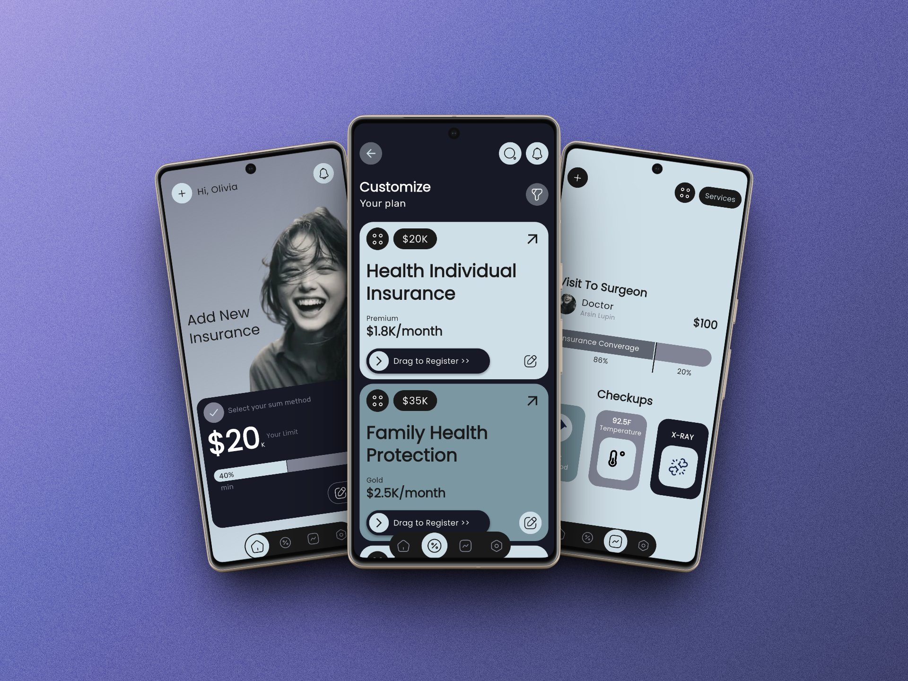

# 🛡️ CareSync

CareSync is a modern Flutter-based insurance and healthcare management application designed to provide users with a smooth, secure, and organized digital experience.

The project focuses on clean UI design, responsive layouts, scalable architecture, and seamless mobile performance.

---


# ✨ Features

* Modern Flutter UI
* Responsive mobile design
* Smooth screen navigation
* Clean and scalable architecture
* Insurance & healthcare-focused workflow
* Organized code structure
* Optimized performance

---

# 📱 App Screens



---

# 🛠️ Tech Stack

* Flutter
* Dart
* Material Design
* Responsive UI Design

---

# 📂 Project Structure

```bash
lib/
│
├── core/
├── models/
├── screens/
├── widgets/
├── services/
└── main.dart
```

---

# 🚀 Getting Started

## Prerequisites

Before running the project, make sure you have:

* Flutter SDK
* Dart SDK
* Android Studio / VS Code
* Git Installed

---

# ⚡ Installation

Clone the repository:

```bash
git clone https://github.com/dartrox404/CareSync.git
```

Go to project directory:

```bash
cd CareSync
```

Install dependencies:

```bash
flutter pub get
```

Run the app:

```bash
flutter run
```

---

# 🎯 Project Goal

The main goal of CareSync is to explore modern Flutter development practices while building a professional insurance and healthcare mobile application with clean architecture and scalable UI.

---

# 📈 Future Improvements

* Firebase Integration
* Authentication System
* Insurance Claim Tracking
* AI Assistance
* Push Notifications
* Cloud Data Sync
* Dark Mode Support

---

# 🤝 Contributions

Contributions and suggestions are welcome.

Feel free to fork this repository and submit a pull request.

---

# ⭐ Support

If you like this project, give it a star on GitHub ⭐

---

# 👨‍💻 Developer

Arslan Javed

LinkedIn:
[www.linkedin.com/in/arslan-javed-060aaa35b](http://www.linkedin.com/in/arslan-javed-060aaa35b)

GitHub:
https://github.com/dartrox404
